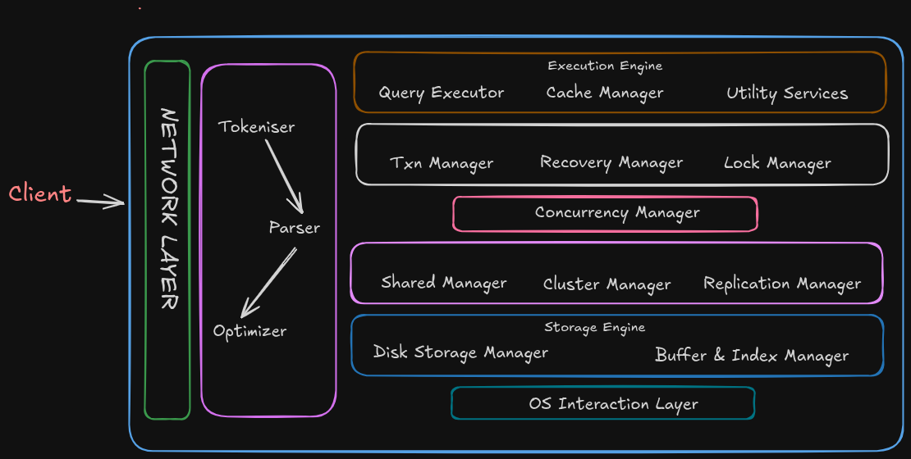

#### DBMS

### Interview Preparation

- Notes for creating a robust understanding about the working of a database system.

### Full SQL Knowledge

- It consists of scripts to understand and learn Structured Query Language.
- Consists of all the clauses with examples.
